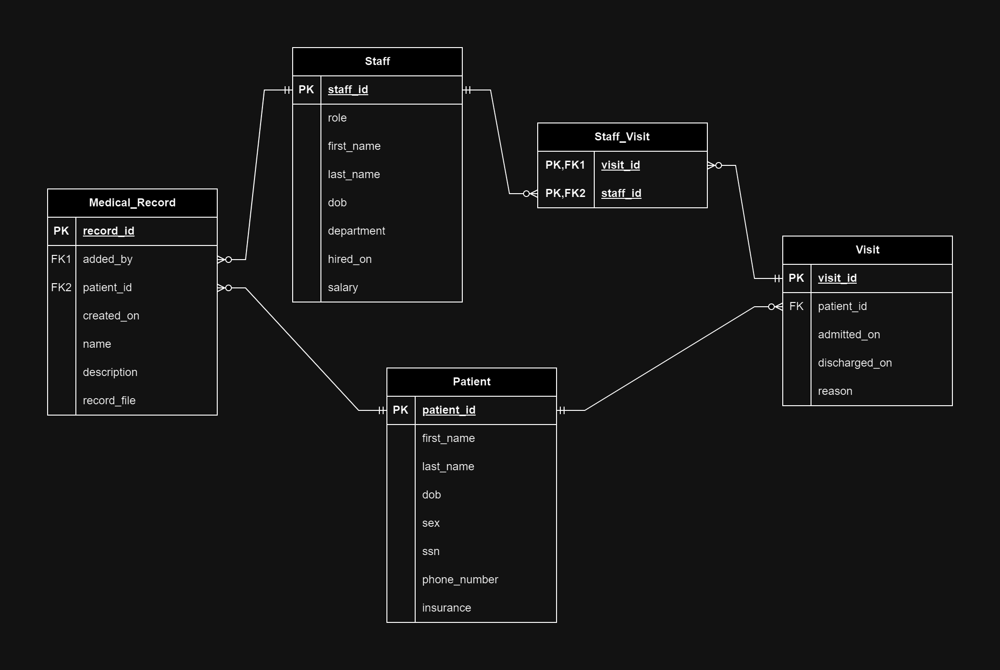

# Hospital Management System
This Spring Boot application allows hospital employees to easily manage hospital data regarding patients, staff, visits, and medical records. 

The application uses Spring Data JPA to store data in a PostgreSQL database. A REST API is exposed to the client to support adding, viewing, and updating operations. Thymeleaf templates are used to display the data in the browser.

## Data Model
The SQL database schema implements the following ERD:

